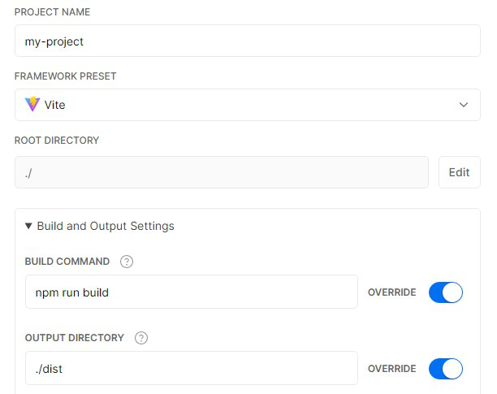

# 静的サイトのデプロイ

以下のガイドは、いくつかの共通の前提に基づいています:

- デフォルトのビルド出力場所（`dist`）を使用します。この場所は [`build.outDir` で変更することができます](https://vitejs.dev/config/#build-outdir)ので、その場合はこれらのガイドを読み替えてください。
- npm を使用します。Yarn や他のパッケージマネージャを使用している場合は、同等のコマンドを使用してスクリプトを実行できます。
- Vite はプロジェクト内のローカルな dev dependency としてインストールされており、以下の npm スクリプトを設定しています。

```json
{
  "scripts": {
    "build": "vite build",
    "serve": "vite preview"
  }
}
```

`vite preview` は、ローカルでビルドをプレビューするためのもので、本番用のサーバとしては使えないことに注意してください。

::: tip 注意
このガイドは、Vite で静的サイトをデプロイするための手順を提供します。Vite は、サーバサイドレンダリング（SSR）も試験的にサポートしています。SSR とは、Node.js で同じアプリケーションを実行し、それを HTML にプリレンダリングし、最終的にクライアント上でハイドレートすることをサポートするフロントエンドフレームワークを指します。この機能については、[SSR ガイド](./ssr)をご覧ください。一方、従来のサーバサイドフレームワークとの統合を探している場合は、代わりに[バックエンドとの統合ガイド](./backend-integration)をチェックしてください。
:::

## アプリのビルド

アプリをビルドするために、`npm run build` コマンドを実行します。 

```bash
$ npm run build
```

デフォルトでは、ビルド結果は `dist` に置かれます。この `dist` フォルダを、お好みのプラットフォームにデプロイします。

## アプリをローカルでテストする

アプリをビルドしたら、`npm run serve` コマンドを実行し、ローカルでテストします。

```bash
$ npm run build
$ npm run serve
```

`vite preview` コマンドは、ローカルで静的なウェブサーバを起動し、`dist` のファイルを http://localhost:5000 で配信します。これは、プロダクションビルドが問題ないかどうかを自分のローカル環境で確認する簡単な方法です。

サーバのポートを設定するには、引数に `--port` フラグを指定します。

```json
{
  "scripts": {
    "serve": "vite preview --port 8080"
  }
}
```

これで、`preview` メソッドは http://localhost:8080 でサーバを起動します。

::: tip 注意
スクリプト名を `serve` から `preview` に変更すると、一部のパッケージマネージャーでは [Pre & Post scripts](https://docs.npmjs.com/cli/v7/using-npm/scripts#pre--post-scripts) の処理方法が原因で問題が発生する可能性があります。
:::

## GitHub Pages

1. `vite.config.js` で `base` を正しく設定してください。

   `https://<USERNAME>.github.io/` にデプロイする場合、`base` はデフォルトで `'/'` となるのでこれを省略できます。

   `https://<USERNAME>.github.io/<REPO>/` にデプロイする場合、例えばリポジトリが `https://github.com/<USERNAME>/<REPO>` にあるなら、`base` を `'/<REPO>/'` と設定してください。

2. プロジェクト内で以下の内容の `deploy.sh` を作成し（ハイライトされた行はコメントアウトされています）、これを実行してデプロイしてください:

   ```bash{13,20,23}
   #!/usr/bin/env sh

   # エラー時は停止
   set -e

   # ビルド
   npm run build

   # ビルド出力ディレクトリに移動
   cd dist

   # カスタムドメインにデプロイする場合
   # echo 'www.example.com' > CNAME

   git init
   git add -A
   git commit -m 'deploy'

   # https://<USERNAME>.github.io にデプロイする場合
   # git push -f git@github.com:<USERNAME>/<USERNAME>.github.io.git master

   # https://<USERNAME>.github.io/<REPO> にデプロイする場合
   # git push -f git@github.com:<USERNAME>/<REPO>.git master:gh-pages

   cd -
   ```

::: tip
また、CI の設定で上記のスクリプトを実行することで、プッシュごとの自動デプロイを有効にすることができます。
:::

### GitHub Pages と Travis CI

1. `vite.config.js` で `base` を正しく設定してください。

   `https://<USERNAME or GROUP>.github.io/` にデプロイする場合、`base` はデフォルトで `'/'` となるのでこれを省略できます。

   `https://<USERNAME or GROUP>.github.io/<REPO>/` にデプロイする場合、例えばリポジトリが `https://github.com/<USERNAME>/<REPO>` にあるなら、`base` を `'/<REPO>/'` と設定してください。

2. プロジェクトルートに `.travis.yml` という名前でファイルを作成してください。

3. ローカルで `npm install` を実行し、生成されたロックファイル（`package-lock.json`）をコミットしてください。

4. GitHub Pages のデプロイプロバイダテンプレートを使用し、[Travis CI マニュアル](https://docs.travis-ci.com/user/deployment/pages/)に従ってください。

   ```yaml
   language: node_js
   node_js:
     - lts/*
   install:
     - npm ci
   script:
     - npm run build
   deploy:
     provider: pages
     skip_cleanup: true
     local_dir: dist
     # GitHub で生成されるトークンで、Travis があなたのリポジトリにコードをプッシュすることを許可します。
     # リポジトリの Travis 設定ページで、セキュア変数として設定します。
     github_token: $GITHUB_TOKEN
     keep_history: true
     on:
       branch: master
   ```

## GitLab Pages と GitLab CI

1. `vite.config.js` で `base` を正しく設定してください。

   `https://<USERNAME or GROUP>.gitlab.io/` にデプロイする場合、`base` はデフォルトで `'/'` となるのでこれを省略できます。

   `https://<USERNAME or GROUP>.gitlab.io/<REPO>/` にデプロイする場合、例えばリポジトリが `https://gitlab.com/<USERNAME>/<REPO>` にあるなら、`base` を `'/<REPO>/'` と設定してください。

2. プロジェクトルートに、`.gitlab-ci.yml` という名前でファイルを作成し、以下のように記述してください。これで、コンテンツを変更するたびにサイトのビルドとデプロイが行われます:

   ```yaml
   image: node:16.5.0
   pages:
     stage: deploy
     cache:
       key:
         files:
           - package-lock.json
         prefix: npm
       paths:
         - node_modules/
     script:
       - npm install
       - npm run build
       - cp -a dist/. public/
     artifacts:
       paths:
         - public
     rules:
       - $CI_COMMIT_BRANCH == $CI_DEFAULT_BRANCH
   ```

## Netlify

1. [Netlify](https://netlify.com) で、GitHub から新規プロジェクトを以下の設定で立ち上げます:

   - **Build Command:** `vite build` or `npm run build`
   - **Publish directory:** `dist`

2. デプロイボタンを押します。

## Google Firebase

1. [firebase-tools](https://www.npmjs.com/package/firebase-tools) をインストールしていることを確認してください。

2. プロジェクトルートに `firebase.json` と `.firebaserc` を作成し、以下のように記述してください:

   `firebase.json`:

   ```json
   {
     "hosting": {
       "public": "dist",
       "ignore": []
     }
   }
   ```

   `.firebaserc`:

   ```js
   {
     "projects": {
       "default": "<YOUR_FIREBASE_ID>"
     }
   }
   ```

3. `npm run build` を実行した後、`firebase deploy` コマンドでデプロイしてください。

## Surge

1. まだインストールしていなければ、[surge](https://www.npmjs.com/package/surge) をインストールしてください。

2. `npm run build` を実行してください。

3. `surge dist` とタイプし、surge にデプロイしてください。

`surge dist yourdomain.com` とすることで、[カスタムドメイン](http://surge.sh/help/adding-a-custom-domain)にデプロイすることもできます。

## Heroku

1. [Heroku CLI](https://devcenter.heroku.com/articles/heroku-cli) をインストールしてください。

2. [サインアップ](https://signup.heroku.com)して Heroku アカウントを作成してください。

3. `heroku login` を実行し、Heroku の認証情報を入力してください:

   ```bash
   $ heroku login
   ```

4. プロジェクトルートに `static.json` という名前でファイルを作成し、以下のように記述してください:

   `static.json`:

   ```json
   {
     "root": "./dist"
   }
   ```

   これはあなたのサイトの設定です。詳しくは [heroku-buildpack-static](https://github.com/heroku/heroku-buildpack-static) をご覧ください。

5. Heroku の Git リモートを設定してください:

   ```bash
   # バージョン更新
   $ git init
   $ git add .
   $ git commit -m "My site ready for deployment."

   # 名前を指定して新しいアプリを作成
   $ heroku apps:create example

   # 静的サイト用に buildpack を設定
   $ heroku buildpacks:set https://github.com/heroku/heroku-buildpack-static.git
   ```

6. サイトをデプロイしてください:

   ```bash
   # サイトを公開
   $ git push heroku master

   # ブラウザを開いて Heroku CI ダッシュボードを見る
   $ heroku open
   ```

## Vercel

Vite アプリを [Vercel for Git](https://vercel.com/docs/git) でデプロイするために、Git リポジトリにコードがプッシュされていることを確認してください。

https://vercel.com/import/git から、お好みの Git（GitHub、GitLab または BitBucket）を使ってプロジェクトを Vercel にインポートしてください。ウィザードに従って、プロジェクトの `package.json` でプロジェクトルートを選択し、`npm run build` を使ってビルドステップを上書きし、出力ディレクトリを `./dist` としてください。



プロジェクがトインポートされると、その後のブランチへの全てのプッシュでプレビューデプロイメントが生成され、プロダクションブランチ（通常は "main"）での変更はプロダクションデプロイメントが生成されます。

デプロイされると、アプリを直接見るための URL を取得できます。例えば https://vite.vercel.app のようなものです。

## Azure Static Web Apps

Microsoft Azure [Static Web Apps](https://aka.ms/staticwebapps) サービスを使って、Vite アプリを素早くデプロイすることができます。必要なもの:

- Azure アカウントとサブスクリプションキー。[無料で Azure アカウント](https://azure.microsoft.com/free)を作成できます。
- [GitHub](https://github.com) にプッシュされたアプリのコード。
- [Visual Studio Code](https://code.visualstudio.com) の [SWA 拡張機能](https://marketplace.visualstudio.com/items?itemName=ms-azuretools.vscode-azurestaticwebapps)。

VS Code に拡張機能をインストールし、アプリのルートに移動してください。Static Web Apps 拡張機能を開き、Azure にサインインし、'+' マークをクリックして新しい Static Web App を作成してください。使用するサブスクリプションキーを指定するプロンプトが表示されます。

拡張機能が起動するウィザードに従って、アプリの名前を決め、フレームワークのプリセットを選択し、アプリのルート（通常は `/`）とビルドファイルの場所 `/dist` を指定します。ウィザードが実行されると、リポジトリの `.github` フォルダに GitHub アクションが作成されます。

このアクションが実行されると、アプリがデプロイされます（進行状況はリポジトリの Actions タブで確認できます）。正常に完了すると、GitHub アクション実行時に表示される 'Browse Website' ボタンをクリックすることで、拡張機能の進行状況ウィンドウで指定されたアドレスでアプリを見ることができます。
